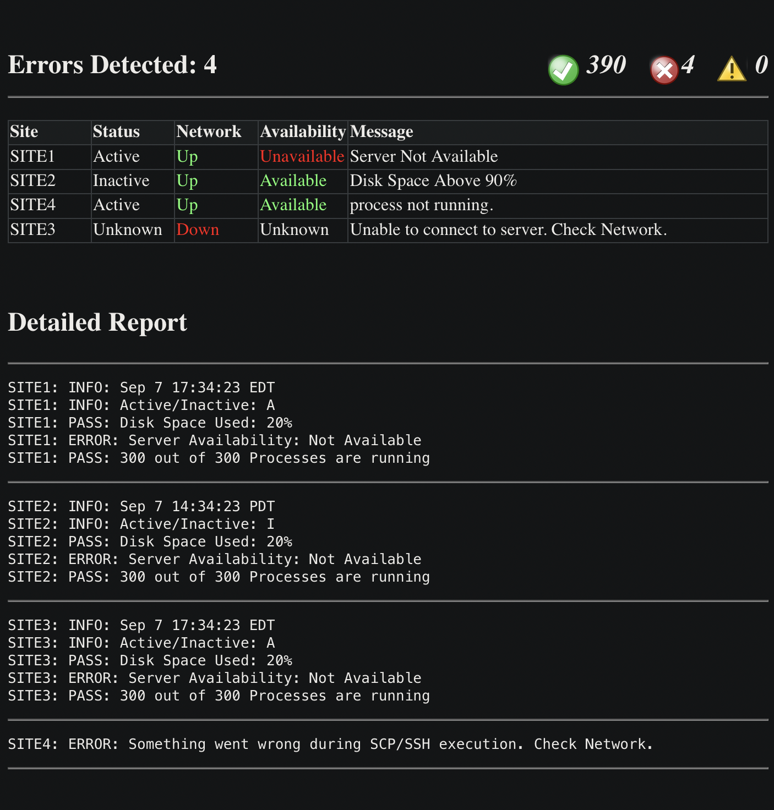

This report is a solution I developed using <strong>Parallel Stages</strong> in Jenkins scripted pipelines, significantly improving build run times.
The environment utilizing this script has approximately 400 servers.

Here is a comparison of average runtimes:

<table>
  <tr>
      <th>Current Run time</th>
      <th>Previous Run time</th>
  </tr>
  <tr>
      <th><strong>4 minutes</strong></th>
      <th>30-40 Minutes</th>
  </tr>
</table>

The previous script had several issues, such as:

<ul>
  <li>Code duplication (copy/pasting instead of using functions)</li>
  <li>No error handling</li>
  <li>Lack of text formatting</li>
  <li>False negatives in the results</li>
</ul>

By addressing these problems and optimizing the pipeline, the new solution is faster, more reliable, 
 excel ready and the code is easier to read (Work In Progress).

<h3>Example Report</h3>

